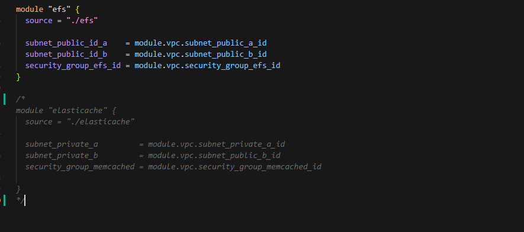

# Solução de Infraestrutura para WordPress com Alta Disponibilidade e VPN na AWS

## Descrição do Projeto
Este projeto apresenta uma infraestrutura para hospedar um site WordPress com alta disponibilidade na AWS. Além disso, inclui uma instância privada para aplicações Docker, acessível via VPN. A solução foi projetada com foco em escalabilidade, desempenho e segurança, utilizando serviços da AWS.

## Principais Componentes da Infraestrutura
- **Auto Scaling**: Escalabilidade automática para alta disponibilidade e melhor desempenho.
- **EFS (Elastic File System)**: Armazenamento compartilhado para mídia e arquivos do WordPress.
- **RDS Multi-AZ**: Banco de dados relacional com redundância em múltiplas zonas de disponibilidade.
- **Elasticache (Memcached)**: Cache para melhorar o tempo de resposta das aplicações.
- **Application Load Balancer (ALB)**: Balanceador de carga para distribuição eficiente de tráfego.
- **VPN com Pritunl**: Conexão segura para acessar instâncias privadas.
- **Amazon CloudWatch**: Monitoramento e alertas para saúde da infraestrutura.

## Ferramentas e Tecnologias
- **Terraform**: Para provisionamento automatizado de infraestrutura.
- **Docker**: Para gerenciamento de containers.
- **Pritunl**: Para configurar a VPN.
- **AWS**: Plataforma de nuvem para hospedar os serviços.
- **Ansible**: Para gerenciar a configuração das instâncias.

## Requisitos Necessários
- Conta AWS com permissões administrativas.
- Terraform versão 1.1.7 ou superior.
- Versão do provider 5.0 ou superior
- AWS CLI configurado no ambiente local.
- Sistema Linux ou Windows para execução dos comandos.

## Como Configurar e Utilizar

### Passo 1: Clonar o Repositório
Faça o download do código do projeto:
```bash
$ git clone https://github.com/Pretoriano88/Infra_WP.git
$ cd Infra_WP/terraform
```

### Passo 2: Configurar as Variáveis
Edite o arquivo `terraforms.tfvars` para incluir informações como região, credenciais e e-mail para notificações do CloudWatch.

### Passo 3: Inicializar o Terraform
Prepare o ambiente do Terraform:
```bash
$ terraform init
```
### Se não quiser usar algum recurso, basta apenas comentar usando /* */ no main, para que o terraform não chame determinado modulo, lembrando que alguns modeulos dependem do outro, exemplo: modulo autoscaling+template depende do modulo Rds  

### Passo 4: Planejar a Infraestrutura
Verifique os recursos que serão criados:
```bash
$ terraform plan -var-file="terraforms.tfvars"
```

### Passo 5: Criar a Infraestrutura
Aplique as configurações na AWS:
```bash
$ terraform apply -var-file="terraforms.tfvars"
```
Confirme a execução digitando `yes` quando solicitado.

### Passo 6: Validar o WordPress
Após o provisionamento, acesse o IP público da instância pelo navegador para validar o funcionamento do WordPress.

## Configuração da VPN com Pritunl
1. Acesse a instância que hospeda o Pritunl:
   ```bash
   ssh -i "my-key-pair.pem" ubuntu@<ip_da_instancia>
   ```
2. Gere a chave de configuração inicial:
   ```bash
   sudo pritunl setup-key
   ```
3. Consulte as credenciais de administrador:
   ```bash
   sudo pritunl default-password
   ```
4. Configure o Pritunl:
   - Acesse a interface web na porta `1194`.
   - Crie uma organização e adicione usuários.
   - Vincule a organização a um servidor e inicie-o.

5. Baixe o arquivo de configuração do usuário e importe no cliente VPN Pritunl.


### Passo 7: Configurar as Variáveis
```bash
$ terraform destroy 
```
Confirme a execução digitando `yes` quando solicitado.


## Observações Finais



Para evitar custos desnecessários, comente o código do modulo **elasticache** ou o modulo que não irá usar 


---


